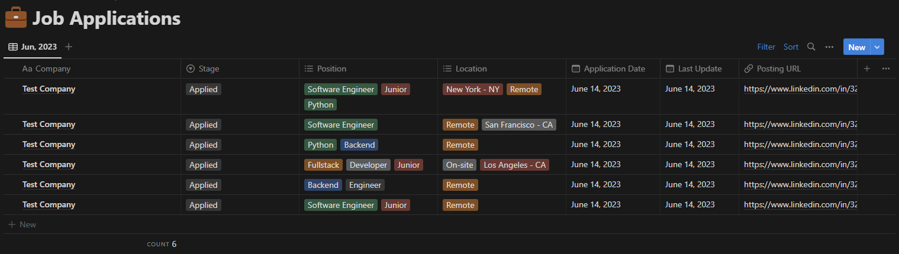

# Notion Job Tracker

## Description
This project allows you to easily add job information to a Notion database from the terminal. It uses the Notion API to interact with your Notion workspace and provides a convenient command-line interface for adding job details.

## Features
- Add job information to a Notion table from the terminal
- Specify job details such as title, company, location, and description
- Automatically syncs the added information with your Notion workspace

## Requirements
- Python 3.x
- Notion API credentials (refer to Notion API documentation for setup)

## Installation
1. Clone this repository to your local machine.
```
git clone https://github.com/viniciusenari/notion-job-tracker
```
2. Create a Python virtual environment.
```
python3 -m venv venv
```
3. Activate the virtual environment.
```
source venv/bin/activate
```
4. Install the required Python packages using pip.
```
pip install -r requirements.txt
```
## Configuration
Before running the program, make sure to configure the following settings in the `.env` file:
- `NOTION_API_KEY`: Your Notion API key.
- `NOTION_DATABASE_ID`: The ID of the Notion database where you want to add the job information.

To obtain the Notion API Key, follow the steps in the documentation [here](https://developers.notion.com/docs/create-a-notion-integration).  

Create a notion database with the following columns and types:
- Company (text)
- Stage (select)
- Position (multi-select)
- Location (multi-select)
- Application Date (date)
- Last Update (date)
- Posting URL (url)

To obtain the Notion database ID, go to the database you created and copy the shareable link. It should look like this: `https://www.notion.so/{work_space_name}/{database_id}`. The database ID is the last part of the link.  
**Important: add a connection to the Notion integration on your database**
## Usage
1. Open your terminal and navigate to the project directory.
2. Run the following command to start the program:
```
python3 main.py
```
3. The program will prompt you to enter the job details such as company, job title, location, and posting url.
4. Once you have entered all the required information, the program will add the job details to your Notion database.

Here is an example of how the job information will look like in your Notion database, you can update it manually if needed:


## Contributions
Contributions are welcome! If you have any ideas or suggestions to improve this project, please open an issue or submit a pull request.

## License
This project is licensed under the [MIT License](LICENSE).